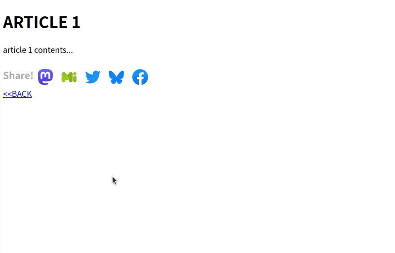

# Musasabi (むささび): Multi SNS Share Button (v1.1)

## Abstract

Musasabi (*mssb* for short) is a web site share button that works with multiple social media platforms. It has these features:

- It works with Mastodon, Misskey, Twitter, and Facebook.
- You can choose between Japanese and English for the display language.
- You can use it with a keyboard.
- It is easy to install and does not require any other libraries.
- It does not communicate with any third-party sites except for the site where you installed it and the social media platforms you want to share with, so you can use it safely.
- You can also use it as a button to share individual articles from a list page.

## System Requirements

- Web browser: Chrome (37 or later), Firefox (98 or later)
  - It should work on any modern browser that supports the `dialog` element. 

## Deployment Methods

First, copy `mssb.js`, `mssb.css`, and all the icon files in `icons/` to the appropriate location on the destination site.

Then modify the site's page (or template) as follows.

### In Case of Single Article Page

To add a button to share the page (blog entry, etc.) that the user is viewing, first add the following code to the `head` element of the page.

```html
...
<link href="../mssb.css" rel="stylesheet">
<script src="../mssb.js"></script>
<script>
  const config = {
    lang: "ja",
    icon_prefix: "icons/",
  }      
  const mssb = new MultiSnsShareButton(config)
</script>
```

The `config` object contains the settings for mssb. The following settings are available.

|Name       | Type       | Meaning |
|:----------|:---------|:-----|
|`lang` |`string` | The display language of the *mssb* UI. You can specify "en" (English) or "ja" (Japanese).|
|`icon_prefix` | `string` | The reference destination of the icons.<br>If the placement is not in the same directory as the page, specify the directory path (e.g., "icons/" (the path separator character is required at the end)).<br>If the icon file name conflicts with an existing file name, rename the icon file name with an arbitrary prefix and specify the prefix in this item (e.g., "mssb-" (rename "mastodon-icon.svg" etc. to "mssb-mastodon-icon.svg" etc.)).|
|`sns_order`| `Array` of `string` | Specifies the order of the icons.<br> Provide an array listing the names of the SNS platforms in the order you want their icons to appear. The SNS listed at the beginning of the array will be displayed on the far left. You can specify the following SNS names: `"mastodon"`, `"misskey"`, `"twitter"`, `"bluesky"`, `"facebook"`.<br>If this configuration item is specified, the icons for SNS not included in the array will not be displayed. If this configuration item is omitted, the default value will be `[ "mastodon", "misskey", "twitter", "bluesky", "facebook" ]`. |

Next, add a placeholder as follows to the place where you want to display the share buttons on the page.

```html
...
<div class="article">
  <h1>ARTICLE 1</h1>
  <p>Content of article 1...</p>
  <div class="mssb-placeholder"></div>
</div>
```

The placeholder is a block element (such as a div element) with the class name `mssb-placeholder`. When the page is loaded, *mssb* will add share buttons inside this element.

### In Case of Article List Page

If you want to place a share button for each article on a page that displays a list of multiple articles, add the following code to the `head` element of the page.

```
<link href="../mssb.css" rel="stylesheet">
<script src="../mssb.js"></script>
<script>
  const config = {
    lang: "ja",
    icon_prefix: "../icons/",
    article_selector: "div.article",
    title_selector: "h2",
    link_selector: "h2 a[href]"
  }
  const mssb = new MultiSnsShareButton(config)
</script>
```

Add settings to the `config` object to identify articles on the page. The following settings are available.

|Name       | Type       | Meaning |
|:----------|:---------|:-----|
|`article_selector` |`string`| Specifies a CSS selector to select the article element on the page. The article element is the element that contains all of following elements: the element represents the title of the article, the `a` element linked to the permalink of the article, and the element that serves as a placeholder for *mssb*.|
|`title_selector` |`string`| Specifies a CSS selector to select the element represents the title of the article. The selector is written relative to the article element. The text content of the selected element is written as the title in the post body when sharing (except for sharing on Facebook).|
|`link_selector` |`string`| Specifies a CSS selector to select the `a` element linked to the permalink within the article. The selector is written relative to the article element. The `href` attribute value of the selected element is written as the article URL in the post body when sharing.|

Add placeholders to each element of the article on the page.

```html
<div class="article">
  <h2><a href="article_1.html">ARTICLE 1</a></h2>
  <p>content of article 1...</p>
  <div class="mssb-placeholder"></div>
</div>
<div class="article">
  <h2><a href="article_2.html">ARTICLE 2</a></h2>
  <p>content of article 2 ...</p>
  <div class="mssb-placeholder"></div>
</div>
```

## Usage of the Share Button

### Share on Mastodon, Misskey

To share on Mastodon, follow these steps (the video shows how it works on Chrome 131).

> 

- Click the Mastodon icon on the article page.
  - The icon enlarges when hovered over with the mouse.
  - A tooltip saying "Share on Mastodon" is displayed when hovered over.
  - With a keyboard, use the Tab key to select the link (or similar), then press the Enter key.
- A dialog titled "Specify Mastodon Instance and Share" opens.
- Enter the instance URL in the instance URL input field.
  - Clicking the input field (or pressing the down-arrow key with the keyboard) displays input history and a list of popular instances, allowing selection from the list.
    - Input history is recorded and displayed using the browser's autocomplete feature. If this feature is disabled in the browser settings, the input history will not appear.
	- The list of popular instances shows the top 4 instances by user count (as of April 15, 2023), pre-registered in mssb.
    - Typing part of a URL displays items in the input history or popular instances containing that string, allowing selection from the list.
      - This also relies on the browser's autocomplete feature.
    - After entering the instance URL, click the [Share] button.
      - Pressing the Enter key in the input field functions the same way.
    - A new tab opens in the browser, showing the posting page of the specified Mastodon instance.
      - If you are not logged into the instance, the login page will appear. After logging in, the posting page will open.
    - After completing the post, close the Mastodon instance tab to return to the original article page.

The process for sharing on Misskey is similar. The operations are the same, but the icon, dialog colors, and the content of the popular instance list differ.

### Share on Twitter, Bluesky, or Facebook

When sharing on Twitter, Bluesky, or Facebook, clicking the icon immediately opens a new tab in the browser, displaying the posting page for each SNS.

## Advanced Settings

If the structure of the article list page is non-structured and `title_selector` or `link_selector` cannot effectively extract the title or permalink, you may resolve this issue by using the following configuration options in the config object (JavaScript programming skills are required).

|Name       |Type         | Description |
|:----------|:------------|:------------|
|`placeholder_extractor`|function(`article`, `mssb`)|Specify a function that returns a placeholder (HTMLElement type) corresponding to the `article` argument (HTMLElement type). Ensure that a suitable element is passed to `article` by selecting an identifiable element (e.g., the title) using `article_selector`. If needed, you can retrieve config values from `mssb` argument (MultiSnsShareButton type) and use them within the function.|
|`title_extractor`|function(`article`, `mssb`)|Specify a function that returns a title string corresponding to the `article` argument. Other details are the same as `placeholder_extractor`.|
|`link_extractor`|function(`article`, `mssb`)|Specify a function that returns a permalink (URL string) corresponding to the `article` argument. Other details are the same as `placeholder_extractor`.|

For specific examples of configuration, refer to the source code of [samples/index_2.html](samples/index_2.html).

## Q & A

- Q: Can the last entered instance URL be retained as the default value?
  - A: Since the share button is designed to be used across multiple domains, retaining the same default value regardless of the site requires a cross-domain storage mechanism. However, in practice, it can only remember values via cookies or local storage tied to the domain from which the script is loaded. This software is designed with a policy of not communicating with third-party sites, so there are no plans to implement such a feature at this time.
- Q: Can the number of shares be displayed?
  - A: This is not feasible for Mastodon or Misskey. Additionally, as the software is designed with a policy of not executing scripts from external sites, there are no plans to implement this feature.
- Q: I hate Elon Musk. Can I remove just the Twitter share button?
  - A: Specify the `sns_order` configuration item in `config`. Provide an array that does not include `"twitter"`.
- Q: After installing it on my site, the layout of the share buttons breaks.
  - A: Existing CSS styles on your site may take precedence over the styles specified in `mssb.css`. In such cases, you need to adjust either your site's existing CSS stylesheet or `mssb.css`. The specific solution will depend on the contents of your CSS stylesheet, so it cannot be addressed here.
- Q: Sharing on [Missky.io](https://misskey.io) occasionally fails.
  - A: This happens occasionally, but the cause is unknown. Based on the error messages, it seems to be a server-side issue...
- Q: Can you support the XXX SNS?
  - A: Since I cannot verify functionality on SNS platforms I don't use, I am currently only considering platforms like Tumblr and mixi. For others, please fork the project to add the feature yourself or ask someone else. If the code has sufficient operational results, I may merge it if you submit a pull request.
- Q: Can you support Google+?
  - A: Listen carefully. Calm down. While you were sleeping, Google+ shut down.

## License

[MIT License](LICENSE), except for icon images.

Licenses of icon images follows:

|File               |Author          |License   |Available at:|
|:------------------|:---------------|:---------|:-----|
|mastodon-icon.svg  |Mastodon gGmbH.|AGPL|https://joinmastodon.org/ja/branding |
|misskey-icon.png   |syuilo and other contributors|CC BY-NC-SA 4.0|https://misskey-hub.net/appendix/assets.html<br>(Margins adjusted)|
|twitter-icon.svg   |Twitter|Apache License 2.0|https://ja.m.wikipedia.org/wiki/%E3%83%95%E3%82%A1%E3%82%A4%E3%83%AB:Twitter-logo.svg |
|facebook-icon.svg  |Facebook|public domain|https://ja.m.wikipedia.org/wiki/%E3%83%95%E3%82%A1%E3%82%A4%E3%83%AB:2021_Facebook_icon.svg |
|bluesky-icon.svg   |Public Benefit Corporation|public domain?|https://bsky.social/about/blog/press-faq<br>(Margins adjusted)|

# Change History

- 2024-12-07: v1.1.1
  - Post of "Share on Bluesky" now contains article title.
- 2024-12-05: v1.1
  - "Share on Bluesky" is now available.
  - Added customization function for button order and display availability.
- 2023-04-16: v1.0
  - First release.
