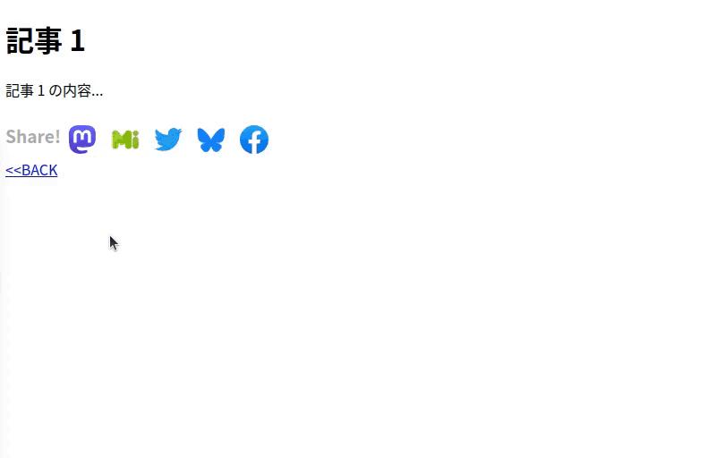
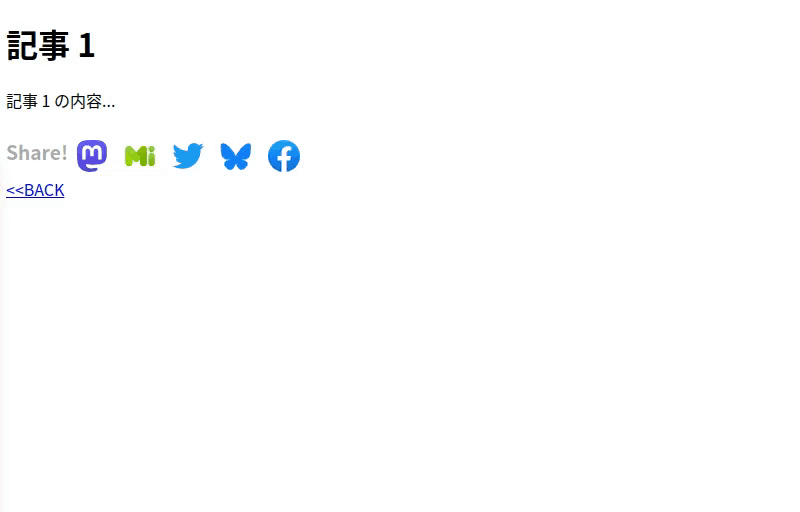

# Musasabi (むささび): Multi SNS Share Button (v1.0)

## 概要

Musasabi (以下 *mssb* と略記)は、複数の SNS に対応した Web サイト用シェアボタンです。以下の特徴があります。

- Mastodon, Misskey, Twitter, Facebook に対応しています。
- 表示言語は日本語と英語に対応しています。
- キーボードでも操作できます。
- 依存ライブラリが一切なく簡単に設置できます。
- 設置先とシェア先のSNS以外の第三者のサイトとは一切通信することなく動作するので安心して使用できます。
- 記事一覧ページに含まれる個別記事をシェアするボタンとしても利用できます。

## 動作環境

- Webブラウザ: Chrome (37 またはそれ以降), Firefox (98 またはそれ以降)
  - 上記以外でも `dialog` 要素をサポートしたモダンブラウザなら動作すると思います。

## 設置方法

まず、`mssb.js` と `mssb.css` と `icons/` 内の全てのアイコンファイルを設置先のサイトの適切な場所にコピーしてください。

次にサイトのページ(またはそのテンプレート)を以下のように修正します。

### 単一ページの場合

閲覧中のページ(ブログエントリ等)をシェアするボタンを設置するには、まず、ページの `head` 要素内に以下のようなコードを追加します。

```html
...
<link href="../mssb.css" rel="stylesheet">
<script src="../mssb.js"></script>
<script>
  const config = {
    lang: "ja",
    icon_prefix: "icons/",
  }      
  const mssb = new MultiSnsShareButton(config)
</script>
```

`config` オブジェクトには *mssb* の設定を記述します。以下の設定項目があります。

|名前       | 型       | 意味 |
|:----------|:---------|:-----|
|`lang` |`string` | *mssb* の UI の表示言語です。"en" (英語) または "ja" (日本語)が指定できます。|
|`icon_prefix` | `string` | アイコンの参照先の設定です。<br>配置先がページと同じディレクトリでない場合はディレクトリパスを指定します(例: "icons/" (末尾にパス区切り文字が必要です))。<br>アイコンファイル名が既存のファイル名と重複する場合はアイコンファイル名を任意の接頭辞を付けた形にリネームし、この項目に接頭辞を指定してください(例: "mssb-" ("mastodon-icon.svg" 等を "mssb-mastodon-icon.svg" 等にリネームした場合))。|

次に、ページ内のシェアボタンを表示する場所に以下のように placeholder を追加します。

```html
...
<div class="article">
  <h1>記事 1</h1>
  <p>記事 1 の内容...</p>
  <div class="mssb-placeholder"></div>
</div>
```

placeholder はクラス名 `mssb-placeholder` を設定したブロック要素(`div` 要素等)です。ページの読込が終わると *mssb* がこの要素の中にシェアボタンを追加します。

### 記事一覧ページの場合

複数の記事の一覧を表示するページ内に各記事のシェアボタンを設置する場合はページの `head` 要素内に以下のようなコードを追加します。

```
<link href="../mssb.css" rel="stylesheet">
<script src="../mssb.js"></script>
<script>
  const config = {
    lang: "ja",
    icon_prefix: "../icons/",
    article_selector: "div.article",
    title_selector: "h2",
    link_selector: "h2 a[href]"
  }
  const mssb = new MultiSnsShareButton(config)
</script>
```

`config` オブジェクトにはページ内の記事を特定するための設定を追加します。以下の設定項目があります。

|名前       | 型       | 意味 |
|:----------|:---------|:-----|
|`article_selector` |`string`| ページ内の記事の要素を選択するためのCSSセレクタを指定します。記事の要素とは、記事のタイトルとなる要素、permalink にリンクした `a` 要素、*mssb* の placeholder となる要素、の全てを包含する要素のことです。|
|`title_selector` |`string`| 記事内のタイトルの要素を選択するためのCSSセレクタを指定します。セレクタは記事の要素を起点としたものを記述します。選択された要素のテキスト内容がシェアする際の投稿本文にタイトルとして記載されます(Facebook でのシェアを除く)。|
|`link_selector` |`string`| 記事内の permalink にリンクした `a` 要素を選択するためのCSSセレクタを指定します。セレクタは記事の要素を起点としたものを記述します。選択された要素の `href` 属性値がシェアする際の投稿本文に記事の URL として記載されます。|

placeholder の追加はページ内の各記事の要素内に追加します。

```html
<div class="article">
  <h2><a href="article_1.ja.html">記事 1</a></h2>
  <p>記事 1 の内容...</p>
  <div class="mssb-placeholder"></div>
</div>
<div class="article">
  <h2><a href="article_2.ja.html">記事 2</a></h2>
  <p>記事 2 の内容...</p>
  <div class="mssb-placeholder"></div>
</div>
```

## シェアボタンの使用法

### Mastodon, Misskey でシェア

Mastodon でシェアする場合は以下のような手順になります(動画は Chrome 112 での様子)。

> 

- 記事画面の Mastodon のアイコンをクリックします。
  - マウスホバーでアイコンが大きく表示されます。
  - マウスホバー「Mastodon でシェア」のツールチップが表示されます。
  - キーボードではタブキーでリンク等と同様に選択して Enter キーを押します。
- 「Mastodon インスタンスを指定してシェア」のダイアログが開きます。
- インスタンスURL入力欄にインスタンスURLを入力します。
  - 入力欄をクリック(キーホードでは↓キー押下)で入力履歴と人気インスタンス一覧が表示され、一覧から選択できます。
    - 入力履歴はブラウザの入力補完(オートコンプリート)機能で記録・表示されます。ブラウザの設定で機能を無効にしている場合は表示されません。
    - 人気インスタンス一覧は *mssb* にユーザー数上位4件(2023/4/15現在)のインスタンスが登録してあり、それを表示しています。
  - URLの一部をタイプすると入力履歴・人気インスタンスにその文字列を含むものがあれば一覧が表示され、そこから選択できます。
    - これもブラウザの入力補完(オートコンプリート)機能によるものです。
- インスタンスURLを入力したら [シェア] ボタンをクリックします。
  - 入力欄で Enter キーを押しても同様に機能します。
- ブラウザに新しいタブが開いて、指定した Mastodon インスタンスの投稿画面が開きます。
  - インスタンスにログインしていない場合はログイン画面が表示され、ログイン完了後に投稿画面が開きます。
- 投稿完了後 Mastodon インスタンスのタブを閉じると元の記事画面に戻ります。

Misskey でシェアする場合も同様です。操作は同様ですが、アイコンとダイアログの配色と人気インスタンス一覧の中身が違います。

> 

### Twitter, Facebook でシェア

Twitter や Facebook でシェアする場合はアイコンをクリックすると直ちにブラウザに新しいタブが開いて、Twitter や Facebook の投稿画面が開きます。 

## 高度な設定

記事一覧ページの構造が非構造的な場合等で、`title_selector`, `link_selector` 等ではうまくタイトルや permalink を抽出できない場合は config の以下の設定項目を使用することで、解決するかもしれません(JavaScript のプログラミングスキルが必要です)。

|名前       |型           | 意味 |
|:----------|:------------|:-----|
|`placeholder_extractor`|function(article, mssb)|引数 article (HTMLElement 型)に対応する placeholder (HTMLElement 型)を返す関数を指定します。article に適切な要素が渡されるように、`article_selector` で記事を識別可能な何らかの要素(タイトル等)が選択されるようにします。 必要に応じて mssb (MultiSnsShareButton 型)から config の設定値等を取得して関数内で利用できます。|
|`title_extractor`|function(article, mssb)|引数 article に対応するタイトル文字列を返す関数を指定します。その他については `placeholder_extractor` と同様です。|
|`link_extractor`|function(article, mssb)|引数 article に対応する permalink (URL文字列)を返す関数を指定します。その他については `placeholder_extractor` と同様です。|

具体的な設定例は [samples/index_2.ja.html](samples/index_2.ja.html) のソースコードを参考にしてください。

## Q & A

- Q: 最後に入力したインスタンスURLをデフォルト値として保持するようにできませんか?
  - A: シェアボタンは任意のドメインのサイトにまたがって使用されるため、どのサイトでシェアボタンを使用しても同じデフォルト値を得るためにはドメインをまたいだ記憶領域が必要になりますが、通常はどこか特定のドメインに属するサイトから読み込んだスクリプトを実行してクッキーやローカルストレージ等で記憶するしか方法がないと思います。このソフトウェアは第三者のサイトと通信しないというポリシーで設計しているため、今のところそのような機能を実装する予定はありません。
- Q: シェアされた数を表示できませんか?
  - A: Mastodon, Misskey では無理なのと、外部サイトのスクリプトを実行しないポリシーで設計しているので、今のところそのような機能を実装する予定はありません。
- Q: イーロン・マスクが嫌いです。Twitter のシェアボタンだけ外せませんか?
  - A: セレクタ `.mssb_twitter_sharebutton` のルールで `display: none;` を指定してください。`mssb.css` にもコメントアウトした形で記述があります。他の SNS についても同様です。
- Q: 自分のサイトに設置してみたところ、シェアボタンのレイアウトが崩れます。
  - A: サイトの既存の CSS スタイルシートのスタイル指定が `mssb.css` での指定より優先されてしまう場合があります。そのような場合は設置した既存の CSS スタイルシートまたは `mssb.css` を修正する必要があります。具体的な修正方法についてはサイトの CSS スタイルシートの内容によって異なるため、ここではお答えできません。
- Q: [Missky.io](https://misskey.io) でのシェアに失敗することがあります。
  - A: たまになりますが、原因は不明です。エラー表示を見る限りサーバー側の問題のようですが…
- Q: ○○という SNS に対応してください!!
  - A: 私が使っている SNS 以外では動作を確認できないので、今のところ Tumblr と mixi ぐらいしか検討していません。それ以外はご自分で fork して機能追加するか、他の方にお願いしてみてください。十分な動作実績があるコードであれば修正を pull request していただければマージするかもしれません。
- Q: Google+ に対応してください!!
  - いいですか? 落ち着いて聞いてください。あなたが眠っている間に Google+ はサ終しました。

## ライセンス

アイコン画像を除いて [MIT ライセンス](LICENSE) です。

アイコン画像については以下の通りです。

|ファイル           |作者            |ライセンス|入手先|
|:------------------|:---------------|:---------|:-----|
|mastodon-icon.svg  |Mastodon gGmbH.|AGPL|https://joinmastodon.org/ja/branding |
|misskey-icon.png   |syuilo and other contributors|CC BY-NC-SA 4.0|https://misskey-hub.net/appendix/assets.html<br>(余白を調整しています)|
|twitter-icon.svg   |Twitter|Apache License 2.0|https://ja.m.wikipedia.org/wiki/%E3%83%95%E3%82%A1%E3%82%A4%E3%83%AB:Twitter-logo.svg |
|facebook-icon.svg  |Facebook|public domain|https://ja.m.wikipedia.org/wiki/%E3%83%95%E3%82%A1%E3%82%A4%E3%83%AB:2021_Facebook_icon.svg |
